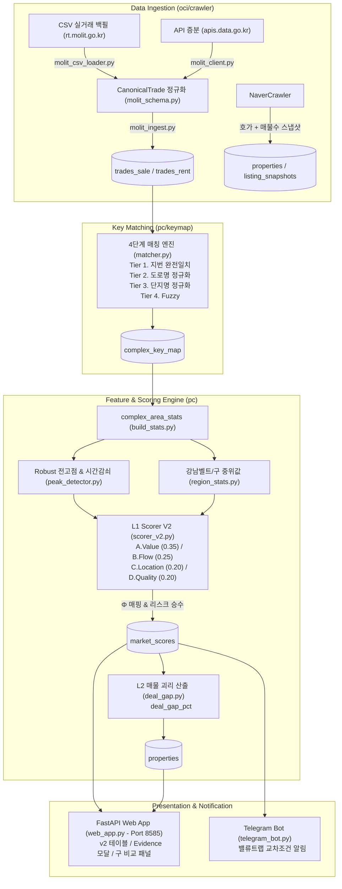

# 부동산 퀀트 스코어링 v2 상세 개발 계획서 (Development Plan)

> **문서 버전**: v1.0.0  
> **작성일**: 2026-07-29  
> **기반 설계서**: `docs/SCORING_V2_DESIGN.md`  
> **검증 대상 데이터**: `csv/2026_서초구_매매.csv` (20개 실물 컬럼 확인), `csv/2026_서초구_전세.csv` (21개 실물 컬럼 확인)

---

## 1. 개요 및 실물 CSV 검증 요약

`docs/SCORING_V2_DESIGN.md` 설계서에 명시된 **"비교군 상대평가 기반 4-Block 팩터 모델(v2)"** 및 **L1(시장 점수: 단지×평형) / L2(매물 괴리: 개별 호가)** 2계층 분리 스코어링 체계를 구현하기 위한 마일스톤 및 마이크로 태스크 계획입니다.

### 1.1 `csv/` 실물 데이터 파싱 검증 결과
- **`2026_서초구_매매.csv` (20개 컬럼 완료)**:
  - 16번째 행(line 16)에서 실제 헤더 시작: `NO | 시군구 | 번지 | 본번 | 부번 | 단지명 | 전용면적(㎡) | 계약년월 | 계약일 | 거래금액(만원) | 동 | 층 | 매수자 | 매도자 | 건축년도 | 도로명 | 해제사유발생일 | 거래유형 | 중개사소재지 | 등기일자`
  - **설계 일치성**: `해제사유발생일`, `거래유형(중개/직거래)`, `등기일자(YY.MM.DD)`, `본번/부번/도로명`이 모두 제공됨을 확인. API 폴백 없이 CSV 단독으로 **G2(특수거래 비중), G2b(미등기 장기경과), 4단계 단지 지번 매칭**이 완벽히 작동합니다.
- **`2026_서초구_전세.csv` (21개 컬럼 완료)**:
  - 16번째 행에서 헤더 시작: `NO | 시군구 | 번지 | 본번 | 부번 | 단지명 | 전월세구분 | 전용면적(㎡) | 계약년월 | 계약일 | 보증금(만원) | 월세금액(만원) | 층 | ... | 계약구분 | 갱신요구권사용`
  - **설계 일치성**: `월세금액(0원 = 순수전세)` 필터링을 통해 **A2(전세가율)** 및 **A4(환산 임대수익률)** 산출 원천 데이터로 즉시 활용 가능합니다.

---

## 2. 전체 아키텍처 및 데이터 플로 개편 계획

---

## 3. Phase별 로드맵 및 구현 범위

### 3.1 [Phase 1] 기반 재구축 및 임계 경로 필수 구현 (우선 착수)
> **목표**: L1/L2 2계층 분리, 국토부 CSV 로딩 및 4단계 지번 매칭, Block A(A1 초과하락률, A3 상대평단가), Block C(C1 역세권), Block D(D1 규모, D2 연식곡선, D4 브랜드), G1~G7 품질 게이트, Web 대시보드 v2 컬럼 및 Evidence 모달 반영.

- **[Step 1] 공통 모듈 및 전용면적 매퍼 구축**
  - `common/area_mapper.py`: `exclusive_area` (㎡) → `area_type` (`A40`, `A59`, `A84`, `A114`, `A135P`) 변환 함수 (`to_area_type()`) 구현 및 단위 테스트.
- **[Step 2] 버전 관리 기반 DB 마이그레이션 엔진**
  - `common/database.py`: `schema_version` 테이블 도입 및 `common/migrations/001_scoring_v2.sql` 실행 로직 구현.
  - 신규 테이블 정의: `complexes`(단지마스터 확장), `complex_key_map`, `trades_sale`, `trades_rent`, `listing_snapshots`, `complex_area_stats`, `market_scores`, `score_runs`, `region_stats`.
  - 기존 `properties` 컬럼 확장: `area_type`, `exclusive_area`, `deal_gap_pct`, `floor_grade`, `score_v1`, `last_seen_at`.
- **[Step 3] 국토부 실거래 정규화 어댑터 (`molit_schema.py`)**
  - CSV 및 API의 필드명을 딕셔너리 매핑으로 정규화하여 `CanonicalTrade` frozen dataclass로 반환하는 로직.
- **[Step 4] 실거래가 CSV 파서 및 아카이빙 (`molit_csv_loader.py`, `molit_ingest.py`)**
  - `data/raw/molit/<YYYY-MM-DD>/` 디렉토리에 원본 무변경 아카이빙.
  - 헤더 키워드(`"NO"`, `"시군구"`) 탐색으로 시작 행 동적 위치 감지 및 `trades_sale` 적재 (CP949/UTF-8 폴백).
- **[Step 5] 지번 기반 4단계 단지 매칭 엔진 (`pc/keymap/matcher.py`, `review_cli.py`)**
  - Tier 1(지번 일치), Tier 2(도로명 일치), Tier 3(단지명+건축년도 정규화), Tier 4(Fuzzy > 0.85).
  - 미매칭 건 보충을 위한 CLI 대화형 검수 도구 작성.
- **[Step 6] Robust 전고점 탐지 및 시간감쇠 (`pc/features/peak_detector.py`)**
  - 60개월 롤링 3개월 윈도우 p90 상위 분위수 산출 + 36개월 반감기 지수 감쇠(`DECAY_TAU=36.0`, `DECAY_FLOOR=0.80`).
- **[Step 7] 지역 기준선 및 L1 피처 빌더 (`region_stats.py`, `build_stats.py`)**
  - `BELT_AREA`(서초+강남 통합) 및 `SGG_AREA`(구별) 기준선 중위값 산출 및 `complex_area_stats` 집계.
- **[Step 8] 비교군 robust_z 정규화 및 품질 게이트 (`peer_group.py`, `gate.py`, `normalizer.py`)**
  - MAD 기반 robust z-score (±3.0 클램핑).
  - G1~G7 게이트 검사 로직 및 `EXCLUDED` 명시적 상태 분류.
- **[Step 9] 4-Block 가중합 산출 및 Evidence JSON 빌더 (`aggregator.py`, `evidence.py`, `scorer_v2.py`)**
  - 결측 팩터 재정규화, 정규분포 CDF(`Φ`) 변환 및 100점 만점 매핑.
  - 셀 클릭 시 기여도 및 비교군 통계를 확인할 수 있는 `evidence_json` 직렬화.
- **[Step 10] L2 매물 괴리율 산출 (`pc/l2/deal_gap.py`)**
  - 3M 중위 실거래 기준가 × 층 조정계수(`LOW: 0.95, MID: 1.00, HIGH: 1.03`) 대비 호가 괴리율(`deal_gap_pct`) 연산.
- **[Step 11] 스마트 로컬 웹 대시보드 v2 개편 (`pc/web_app.py`)**
  - v2 11개 컬럼(`순위 / 지역 / 단지명 / 평형 / 호가 / 기준가(3M중위) / 괴리율 / 초과하락 / 시장점수 / v1점수 / 매물확인`) UI 반영.
  - 상단 **구(區) 비교 패널**(서초 vs 강남 중위 하락률/평단가 요약) 및 **Evidence 모달 Popup** 렌더링.

---

### 3.2 [Phase 2] 수급·전세 팩터 및 리스크 승수 확장
> **목표**: 전월세 실거래 적재 기반 A2(전세가율), A4(임대수익률) 도입, 매물 수 스냅샷 기반 B1~B4 Flow 팩터, 리스크 승수(×0.80~×0.50), 텔레그램 밸류트랩 교차조건 알림.

- **[Step 12] 전월세 실거래 로더 및 전세가율/수익률 산출**
  - `2026_서초구_전세.csv` 적재 (`trades_rent`) 및 순수 전세(`monthly_rent=0`) 중위 전세가율 연산.
- **[Step 13] Flow 팩터 및 리스크 승수 연산 (`factor_flow.py`, `risk.py`)**
  - `listing_snapshots` 30일 누적 기반 매물 증감률(`B2`), 거래량 회복비(`B1`), 3M 모멘텀(`B4`).
  - 역전세 위험(하위 10% → ×0.80), 입주압박(상위 10% → ×0.70) 곱셈 승수 적용.
- **[Step 14] 텔레그램 알리미 봇 고도화 (`oci/notifier/telegram_bot.py`)**
  - `alert_candidate == True`(초과하락 상위 30% + 거래량 회복 + 매물 감소) 충족 시 발송.
  - 메시지 본문에 **[강점] / [주의]** 라인 동시 출력.

---

### 3.3 [Phase 3 ~ Phase 4] 입지 심화, 백테스트 인프라 및 v1 폐기
- **`PITLoader`**: 미래참조(look-ahead bias)를 강제 차단하는 Point-In-Time 백테스트 로더 (`pc/backtest/pit_loader.py`).
- **IC 리포트**: 팩터별 Spearman Rank IC 및 Q5-Q1 분위 스프레드 보고서 자동화.
- **v1 vs v2 병행 운영**: 4주간 `score_v1`과 `market_score` 순위상관 비교 후 v1 최종 폐기.

---

## 4. 즉시 착수 순서 (Step-by-Step Task Checklist)

1. [ ] `common/area_mapper.py` 작성 및 경계값(`50.0, 70.0, 100.0, 135.0`) 포함 단위 테스트 (`tests/test_area_mapper.py`)
2. [ ] `common/database.py` 스키마 마이그레이션 (`001_scoring_v2.sql` 및 `schema_version` 테이블 적용)
3. [ ] `oci/crawler/molit_schema.py` (`CanonicalTrade` 데이터클래스 및 정규화 계약)
4. [ ] `oci/crawler/molit_csv_loader.py` (헤더 키워드 `"NO", "시군구"` 동적 탐색 CSV 로더)
5. [ ] `oci/crawler/molit_ingest.py` (원본 날짜별 디렉토리 아카이빙 및 DB 적재)
6. [ ] `pc/keymap/matcher.py` (지번/도로명/단지명 4단계 단지 매칭 엔진)
7. [ ] `pc/features/peak_detector.py` (60M 롤링 p90 고점 & 36M 반감기 감쇠)
8. [ ] `pc/features/region_stats.py` & `build_stats.py` (`complex_area_stats` 적재)
9. [ ] `common/peer_group.py` & `pc/scoring/` (`normalizer.py`, `gate.py`, `aggregator.py`, `evidence.py`, `scorer_v2.py`)
10. [ ] `pc/l2/deal_gap.py` (`deal_gap_pct` 연산 로직)
11. [ ] `pc/web_app.py` (v2 테이블, Evidence 모달, 구 비교 요약 패널 UI 구현)
12. [ ] 파이프라인 통합 테스트 및 CLI 검증 (`start.bat` 연동)
